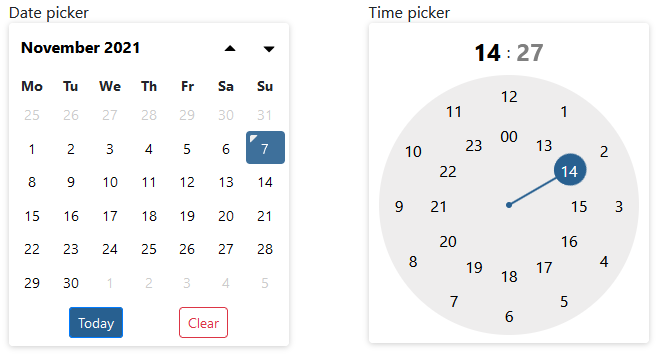

# 📆 Svelty Picker [](https://www.npmjs.org/package/svelty-picker)

Simple date & time picker implemented in svelte. 

Features: 
- datepicker
- timepicker (with meridian support)
- various format
- keyboard navigation (date only for now)
- includes `<input>` element
- custom element 
- validator action for `<input>` using `svelte-use-forms` (optional)



## ⚙️ Install

```
npm install svelty-picker
```

## 👀 Example

```svelte
<script>
  import SveltyPicker from 'svelty-picker'
  
  let myDate = '2021-11-11';
</script>

<SveltyPicker inputClasses="form-control" format="yyyy-mm-dd hh:ii" bind:value={myDate}></SveltyPicker>
```

Try yourself in [REPL](https://svelte.dev/repl/98fd362aad6049f4b38606820baff0b0?version=3.44.1).

## 📓 Options

| Property        | Type         | Default       | Description |
|-----------------|--------------|---------------| ------------------|
| name            | `string`     | `date`        | input name property for underlying `<input>` element |
| value           | `string`     | `null`        | string representation of selected value |
| initialDate     | `Date`       | `null`        | initial date object, if you prefer that to `value` |
| startDate       | `string|Date`| `null`        | limit minimal selectable date |
| endDate         | `string|Date`| `null`        | limit maximal selectable date |
| mode            | `string`     | `auto`        | restrict picker's mode. Possible values: `auto|date|datetime|time`. By default it try to guess the mode from `format` |
| format          | `string`     | `yyyy-mm-dd`  | Format of entered date/time. See [format settings](#format-settings) for available options |
| i18n            | `object`     | `en`          | localization object, english is by default |
| weekStart       | `number`     | `1`           | number in range `0-6` to select first day of the week. Sunday is `0` |
| pickerOnly      | `bool`       | `false`       | Picker is always visible and input field is then hidden, but still present |
| visible         | `bool`       | `false`       | Whether place picker inline after focus. By default picker is floating
| autoclose       | `bool`       | `true`        | Hides picker after selection is done. If mode includes _time picker_, it closes automatically only after minute selection |
| todayBtn        | `bool`       | `true`        | Show today button |
| clearBtn        | `bool`       | `true`        | Show clear button |
| required        | `bool`       | `false`       | Renders `<input>`'s `required parameter |
| inputClasses    | `string`     | ``            | input css class string |
| positionFn      | `function`   | _`internal`_  | function used to position picker. Used as action. Acceps following object: `{ inputEl, visible}`, where `visible` is `visible` parameter & `inputEl` is underlying `<input>` element |
| validatorAction | `array`      | `null`        | Bind validator action for inner `<input>` element. Designed to be used with `svelte-use-form`.

### Format settings

- `p` : meridian in lower case ('am' or 'pm') - according to locale file
- `P` : meridian in upper case ('AM' or 'PM') - according to locale file
- `s` : seconds without leading zeros
- `ss` : seconds, 2 digits with leading zeros
- `i` : minutes without leading zeros
- `ii` : minutes, 2 digits with leading zeros
- `h` : hour without leading zeros - 24-hour format
- `hh` : hour, 2 digits with leading zeros - 24-hour format
- `H` : hour without leading zeros - 12-hour format
- `HH` : hour, 2 digits with leading zeros - 12-hour format
- `d` : day of the month without leading zeros
- `dd` : day of the month, 2 digits with leading zeros
- `m` : numeric representation of month without leading zeros
- `mm` : numeric representation of the month, 2 digits with leading zeros
- `M` : short textual representation of a month, three letters
- `MM` : full textual representation of a month, such as January or March
- `yy` : two digit representation of a year
- `yyyy` : full numeric representation of a year, 4 digits

## 🗯️ Events

Component emits following events: `input`, `change`, `blur`.

## 🌐 Localization

Localization file has following structure.

```js
export const en = {
  days:        ['Sunday', 'Monday', 'Tuesday', 'Wednesday', 'Thursday', 'Friday', 'Saturday', 'Sunday'],
  daysShort:   ['Sun', 'Mon', 'Tue', 'Wed', 'Thu', 'Fri', 'Sat', 'Sun'],
  daysMin:     ['Su', 'Mo', 'Tu', 'We', 'Th', 'Fr', 'Sa', 'Su'],
  months:      ['January', 'February', 'March', 'April', 'May', 'June', 'July', 'August', 'September', 'October', 'November', 'December'],
  monthsShort: ['Jan', 'Feb', 'Mar', 'Apr', 'May', 'Jun', 'Jul', 'Aug', 'Sep', 'Oct', 'Nov', 'Dec'],
  meridiem:    ['am', 'pm'],
  suffix:      ['st', 'nd', 'rd', 'th'],
  todayBtn:    'Today',
  clearBtn:    'Clear',
  timeView:    'Show time view',
  backToDate:  'Back to calendar view'
}
```
PRs for extending built-in localization are welcome 🥳

## 🏆 Thanks to:

- [Bootstrap datepicker](https://github.com/smalot/bootstrap-datetimepicker/blob/master/js/bootstrap-datetimepicker.js) for some internal date and format handling
